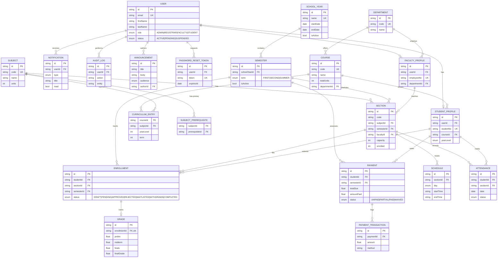

# Entity Relationship Diagram

## Cardinality summary

- A `User` has at most one `StudentProfile` **or** one `FacultyProfile`, depending on `role`.
- A `Course` is offered by exactly one `Department` and aggregates many `Subjects` through a `CurriculumEntry`.
- A `Subject` may have many prerequisites (`SubjectPrerequisite` is a self-referencing join).
- A `Section` belongs to one `Subject` in one `Semester` and is taught by zero/one `FacultyProfile`. It has many `Schedule` slots and many `Enrollment`s.
- `Enrollment` is the central operational record between `Student` and `Section`, optionally producing one `Grade`.
- `Payment` is one per `(Student, Semester)`; each can accumulate many `PaymentTransaction`s.
- `Attendance` is unique on `(student, section, date)`.
- `AuditLog` references the acting user and a target `entity` / `entityId` for traceability.
